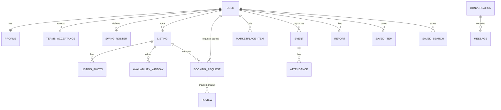

# 03 · Arquitectura

> Las decisiones marcadas como **ADR** están justificadas en `docs/adr/`. Cambiar una decisión = escribir un ADR nuevo que la sustituya, no editar el viejo.

## 1. Visión general

**Monolito modular** con **arquitectura hexagonal (puertos y adaptadores)** en el backend, organizado por **contextos acotados** (DDD), y **un cliente universal** (iOS, Android, Web) que consume una API REST tipada.

```
┌───────────────────────────── Clientes ─────────────────────────────┐
│  apps/app  (Expo + React Native + Expo Router)  → iOS · Android · Web │
│  apps/admin (Next.js)                            → Panel de moderación │
└───────────────┬─────────────────────────────────────────┬─────────────┘
                │ HTTPS REST /v1 (OpenAPI)  ·  WebSocket (chat)          │
┌───────────────▼─────────────────────────────────────────▼─────────────┐
│ apps/api (NestJS) — Monolito modular hexagonal                         │
│  ┌──────────┐ ┌──────────────┐ ┌─────────┐ ┌─────────┐ ┌───────────┐  │
│  │ identity │ │accommodation │ │ booking │ │ reviews │ │ messaging │  │
│  └──────────┘ └──────────────┘ └─────────┘ └─────────┘ └───────────┘  │
│  ┌─────────────┐ ┌───────────┐ ┌────────────┐ ┌───────────────┐       │
│  │ marketplace │ │ community │ │ moderation │ │ notifications │       │
│  └─────────────┘ └───────────┘ └────────────┘ └───────────────┘       │
│  shared kernel · event bus (in-process → outbox) · auth guard          │
└───────┬───────────────┬───────────────┬───────────────┬───────────────┘
        │               │               │               │
   PostgreSQL       Object storage   Auth provider   Email / Push / SMS
   + PostGIS        (fotos)          (JWT, OTP)      Maps · Analytics
```

## 2. Stack (ADR-0002, ADR-0003)

| Capa | Tecnología | Por qué |
|---|---|---|
| Lenguaje | **TypeScript** (strict) en todo el monorepo | Un solo lenguaje para cliente y servidor; tipos compartidos. |
| Monorepo | **pnpm workspaces + Turborepo** | Builds incrementales, caché, paquetes compartidos. |
| Cliente universal | **Expo (React Native) + Expo Router** | Una base de código → iOS, Android y Web. Builds con EAS. |
| Estilos | **NativeWind** (Tailwind para RN) + design tokens en `packages/ui-tokens` | Rápido, consistente en las 3 plataformas. |
| Estado servidor (cliente) | **TanStack Query** | Caché, reintentos, paginación infinita. |
| Formularios | **react-hook-form + Zod** (esquemas de `packages/contracts`) | Misma validación en cliente y servidor. |
| Panel admin | **Next.js + shadcn/ui** | Tablas y formularios densos, solo web. |
| Backend | **NestJS** sobre Node.js LTS | Módulos y DI que encajan con contextos y puertos. **El framework vive solo en los bordes.** |
| Base de datos | **PostgreSQL + PostGIS** | Relacional, búsquedas geográficas y por rango de fechas (`daterange`, índices GiST). |
| Acceso a datos | **Drizzle ORM** (solo en adaptadores) | SQL explícito, buen soporte de tipos y PostGIS. |
| Contratos API | **Zod → OpenAPI 3.1** + cliente tipado generado (`packages/api-client`) | Una fuente de verdad para web, móvil y API. |
| Auth / BaaS inicial | **Supabase** (Auth con email, OTP por SMS, Google, Apple · Postgres gestionado · Storage) | Bajo coste y rápido para el MVP. Todo detrás de puertos → migrable a AWS/GCP. |
| Tiempo real | WebSocket (Socket.IO gateway en NestJS) | Chat; los mensajes pasan por el dominio (moderación, antiestafa). |
| Push | **Expo Notifications** | iOS + Android con una sola API. |
| Email | Resend (o SES) vía `EmailSenderPort` | |
| Mapas / geocoding | Mapbox vía `GeocodingPort` | Autocompletado de direcciones y mapas. |
| Analítica de producto | PostHog vía `AnalyticsPort` | El tráfico es el activo del negocio. |
| Errores / observabilidad | Sentry + logs estructurados (pino) | |
| CI/CD | GitHub Actions · EAS Build/Submit · API en contenedor Docker (Railway / Fly.io / Render) | |

## 3. Estructura del monorepo

```
swingo/
├── CLAUDE.md
├── docs/                         # Producto, arquitectura, ADRs, backlog
├── apps/
│   ├── api/                      # NestJS – backend hexagonal
│   ├── app/                      # Expo – iOS / Android / Web
│   └── admin/                    # Next.js – moderación
├── packages/
│   ├── contracts/                # Esquemas Zod de requests/responses + enums compartidos
│   ├── api-client/               # Cliente HTTP tipado generado desde OpenAPI
│   ├── i18n/                     # Traducciones (en-AU, es) y helpers de formato
│   ├── ui-tokens/                # Colores, tipografía, espaciados
│   └── config/                   # eslint, tsconfig, prettier compartidos
├── infra/                        # docker-compose (Postgres+PostGIS local), IaC futura
├── turbo.json
└── pnpm-workspace.yaml
```

## 4. Backend: arquitectura hexagonal

### 4.1 Capas y regla de dependencia

```
interfaces (driving adapters)  ──►  application  ──►  domain
infrastructure (driven adapters) ─►  application / domain
```

- **domain/** — Entidades, agregados, value objects, eventos de dominio, errores de dominio, servicios de dominio. **TypeScript puro**: sin NestJS, sin Drizzle, sin Zod, sin `Date.now()` (usar `Clock`).
- **application/** — Casos de uso (uno por clase, método `execute`), **puertos de salida** (interfaces: repositorios, servicios externos), comandos/queries y DTOs de salida. Orquesta, no contiene reglas de negocio.
- **infrastructure/** — Adaptadores que implementan los puertos: repositorios Drizzle, Supabase Storage, Mapbox, Resend, Expo Push, PostHog…
- **interfaces/** — Adaptadores de entrada: controllers HTTP, gateways WebSocket, jobs/cron, listeners de eventos. Validan con Zod, mapean a comandos y llaman a casos de uso.
- **`<context>.module.ts`** — Raíz de composición de NestJS: enlaza puertos con adaptadores (`{ provide: LISTING_REPOSITORY, useClass: DrizzleListingRepository }`).

La regla se **verifica automáticamente** en CI (dependency-cruiser / eslint-plugin-boundaries).

### 4.2 Estructura de un contexto

```
apps/api/src/
├── contexts/
│   └── accommodation/
│       ├── domain/
│       │   ├── listing.entity.ts
│       │   ├── availability-window.value-object.ts
│       │   ├── listing-status.ts
│       │   ├── listing-published.event.ts
│       │   └── errors/listing-cannot-be-published.error.ts
│       ├── application/
│       │   ├── ports/
│       │   │   ├── listing.repository.port.ts
│       │   │   ├── listing-search.port.ts
│       │   │   └── geocoding.port.ts
│       │   ├── use-cases/
│       │   │   ├── create-listing.use-case.ts
│       │   │   ├── publish-listing.use-case.ts
│       │   │   └── search-listings.use-case.ts
│       │   └── dto/
│       ├── infrastructure/
│       │   ├── persistence/
│       │   │   ├── listing.schema.ts            # Drizzle
│       │   │   ├── drizzle-listing.repository.ts
│       │   │   └── listing.mapper.ts            # fila ↔ entidad
│       │   └── adapters/mapbox-geocoding.adapter.ts
│       ├── interfaces/
│       │   └── http/listings.controller.ts
│       └── accommodation.module.ts
├── shared/
│   ├── domain/        # Entity, AggregateRoot, ValueObject, DomainEvent, DomainError, Result, Id, Clock, Money, GeoPoint, DateRange, Locale
│   ├── application/   # UseCase<I,O>, EventBus port, UnitOfWork port, CurrentUser
│   └── infrastructure/# db client, config, logger, auth guard (JWT del proveedor), event bus, outbox
└── main.ts
```

### 4.3 Contextos acotados

| Contexto | Responsabilidad | Agregados principales |
|---|---|---|
| `identity` | Usuarios, perfiles, verificación (email, teléfono, futuro ID), roles, roster de swing, aceptación de términos | `User`, `Profile`, `TermsAcceptance`, `SwingRoster` |
| `accommodation` | Anuncios de habitaciones, fotos, condiciones, ubicación, disponibilidad, búsqueda | `Listing` (con `AvailabilityWindow[]`, `Photo[]`) |
| `booking` | Solicitudes de reserva y su ciclo de vida | `BookingRequest` |
| `reviews` | Reseñas mutuas tras estancias completadas, reputación agregada | `Review`, `ReputationSummary` |
| `messaging` | Conversaciones 1-a-1 ligadas a un anuncio, solicitud o artículo | `Conversation`, `Message` |
| `marketplace` | Artículos de segunda mano, categorías y atributos | `MarketplaceItem`, `Category` |
| `community` | Eventos y asistencia (fase 2: guías) | `Event`, `Attendance` |
| `moderation` | Reportes, acciones de moderación, auditoría, filtros de contenido | `Report`, `ModerationAction` |
| `notifications` | Push, email, preferencias, alertas de búsqueda guardada | `Notification`, `SavedSearch` |
| `engagement` | Favoritos / guardados | `SavedItem` |
| *(futuro)* `promotions` | Partners, ofertas, códigos de descuento, espacios patrocinados | `Partner`, `Offer`, `Placement` |
| *(futuro)* `payments` | Pagos entre usuarios, comisiones, depósitos, reembolsos — solo si el negocio lo decide (ADR-0004). Pasarela detrás de `PaymentGatewayPort` | `Payment`, `Payout`, `FeePolicy` |

### 4.4 Comunicación entre contextos

- **Prohibido** importar `domain/` o repositorios de otro contexto.
- **Consultas síncronas** → a través de un **puerto** en el contexto consumidor, implementado por un adaptador que llama a un caso de uso público del otro contexto. Ej.: `booking` define `ListingAvailabilityPort`; su adaptador llama a `accommodation`.
- **Reacciones** → **eventos de dominio**. Ej.: `BookingRequestCompleted` → `reviews` habilita reseñas; `BookingRequestAccepted` → `accommodation` bloquea fechas y `notifications` avisa.
- MVP: bus de eventos en proceso + **patrón outbox** en la misma transacción, para poder pasar a una cola (SQS / Redis-BullMQ / NATS) sin tocar el dominio.

### 4.5 Ejemplo mínimo de puerto + caso de uso

```ts
// application/ports/listing.repository.port.ts
export const LISTING_REPOSITORY = Symbol('LISTING_REPOSITORY');
export interface ListingRepositoryPort {
  findById(id: ListingId): Promise<Listing | null>;
  save(listing: Listing): Promise<void>;
}

// application/use-cases/publish-listing.use-case.ts
export class PublishListingUseCase implements UseCase<PublishListingCommand, void> {
  constructor(
    private readonly listings: ListingRepositoryPort,
    private readonly terms: TermsAcceptancePort,
    private readonly events: EventBusPort,
    private readonly clock: Clock,
  ) {}

  async execute(cmd: PublishListingCommand): Promise<void> {
    const listing = await this.listings.findById(cmd.listingId);
    if (!listing) throw new ListingNotFoundError(cmd.listingId);
    listing.assertOwnedBy(cmd.requesterId);

    const hasAccepted = await this.terms.hasAcceptedCurrent(cmd.requesterId, 'LISTING_PUBLICATION', listing.countryCode);
    listing.publish({ termsAccepted: hasAccepted, now: this.clock.now() }); // reglas en el dominio

    await this.listings.save(listing);
    await this.events.publishAll(listing.pullDomainEvents());
  }
}
```

## 5. Modelo de datos (MVP, simplificado)



Campos clave:

- **USER**: `id (uuid)`, `auth_provider_id`, `email`, `email_verified_at`, `phone_e164`, `phone_verified_at`, `id_verified_at` (futuro), `roles[]`, `status` (ACTIVE/SUSPENDED/BANNED/DELETED), `preferred_locale`, `country_code`, `created_at`.
- **PROFILE**: `display_name`, `avatar_url`, `bio`, `occupation` (p. ej. "Dump truck operator"), `languages[]`, `gender` (opcional, usado solo para filtros de convivencia), `reputation_avg`, `reviews_count`.
- **LISTING**: `id`, `host_id`, `status` (DRAFT/PUBLISHED/PAUSED/EXPIRED/REMOVED), `type`, `title`, `description`, `price_amount_minor` (entero), `currency`, `price_unit`, `max_guests`, `couples_allowed`, `gender_preference`, `amenities` (jsonb tipado/flags), `house_rules`, `min_stay_nights`, `max_stay_nights`, `country_code`, `admin_area`, `locality`, `sub_locality`, `postal_code`, `exact_location geography(Point)`, `public_location geography(Point)`, `timezone`, `published_at`.
- **AVAILABILITY_WINDOW**: `listing_id`, `period daterange` (índice GiST, `EXCLUDE` para evitar solapes dentro del mismo anuncio).
- **BOOKING_REQUEST**: `listing_id`, `guest_id`, `host_id`, `period daterange`, `guests_count`, `status`, `message`, `expires_at`, `responded_at`.
- **REVIEW**: `booking_request_id`, `author_id`, `subject_id`, `direction` (GUEST_TO_HOST/HOST_TO_GUEST), `rating`, `sub_ratings jsonb`, `comment`, `published_at`.
- **MARKETPLACE_ITEM**: `seller_id`, `category_id`, `attributes jsonb` (validado por esquema de categoría), `title`, `description`, `price_amount_minor`, `currency`, `negotiable`, `condition`, `status`, `meeting_area` + ubicación aproximada, `expires_at`.
- **EVENT**: `organizer_id`, `title`, `description`, `starts_at timestamptz`, `ends_at`, `timezone`, `venue`, `locality`, `location`, `capacity`.
- **TERMS_ACCEPTANCE**: `user_id`, `terms_type`, `country_code`, `locale`, `version`, `accepted_at`, `ip_hash`, `user_agent`.
- **REPORT / MODERATION_ACTION / AUDIT_LOG**: entidad reportada (`target_type`, `target_id`), motivo, estado, moderador, acción, fecha.

Convenciones de BD: `snake_case`, PK `uuid` v7, `created_at`/`updated_at` en todas, **dinero en unidades menores (enteros)**, fechas de estancia como `date`/`daterange` (sin hora), instantes como `timestamptz` en UTC, *soft delete* solo donde haya obligación de conservar (reseñas, auditoría).

## 6. Diseño para escala y visión global

| Preocupación | Decisión desde el día 1 | Evolución prevista |
|---|---|---|
| Multi-país | `country_code`, dirección genérica (admin area / locality / sub-locality), términos por país | Configuración por país (moneda por defecto, categorías, textos legales) |
| Idiomas | i18n en clientes y emails; contenido de usuario guarda `locale` | Traducción automática opcional de anuncios |
| Monedas | `Money` value object (importe entero + ISO 4217) | Conversión solo informativa |
| Zonas horarias | Instantes en UTC; estancias como fechas locales + `timezone` del anuncio | — |
| Carga | API *stateless*, escalado horizontal; imágenes por CDN | Réplicas de lectura, caché (Redis) |
| Búsqueda | PostGIS + filtros SQL detrás de `ListingSearchPort` | Motor dedicado (Meilisearch / OpenSearch / Typesense) con otro adaptador |
| Eventos asíncronos | Outbox + bus en proceso | Cola gestionada; extraer contextos a servicios si lo exige la carga |
| Proveedores | Todo servicio externo detrás de un puerto | Cambiar Supabase → AWS/GCP sin tocar dominio |
| Datos personales | Minimización, exportar/borrar cuenta | Residencia de datos por región si se exige |
| Feature flags | Flags simples (PostHog) | Lanzamientos graduales por país |

## 7. Cliente (apps/app)

```
apps/app/
├── app/                      # Rutas Expo Router (finas: solo componen pantallas)
│   ├── (tabs)/stays/…        # Buscar alojamiento
│   ├── (tabs)/market/…       # Marketplace
│   ├── (tabs)/community/…    # Eventos
│   ├── (tabs)/inbox/…        # Mensajes y solicitudes
│   └── (tabs)/profile/…
└── src/
    ├── features/<feature>/   # components · hooks (TanStack Query) · screens · model
    ├── ui/                   # Componentes base del design system
    ├── lib/                  # api client, auth session, analytics, i18n setup
    └── config/
```

- Las pantallas no llaman a `fetch` directamente: usan hooks de `features/*/hooks` que usan `packages/api-client`.
- Navegación principal por pestañas: **Alojamiento · Marketplace · Comunidad · Mensajes · Perfil**.
- Patrón de UX: búsqueda tipo Booking (barra con destino + fechas + personas → lista/mapa → detalle) y grid tipo Facebook Marketplace con filtros.
- Web: rutas públicas de anuncio con renderizado estático/SEO (meta tags, Open Graph para compartir por WhatsApp — canal de adquisición clave).

## 8. API

- REST JSON, versionada: `/v1/...`. Recursos en plural e inglés: `/v1/listings`, `/v1/listings/{id}/availability`, `/v1/booking-requests/{id}/accept`, `/v1/marketplace/items`, `/v1/events`, `/v1/reports`.
- Paginación por cursor. Errores en formato **RFC 9457 (Problem Details)** con `code` estable para traducir en cliente.
- Autenticación: `Authorization: Bearer <JWT del proveedor>`; el guard resuelve `CurrentUser` y los casos de uso validan permisos.
- Idempotencia en acciones sensibles (`Idempotency-Key` en crear solicitud de reserva).
- Rate limiting por usuario/IP en auth, mensajería y creación de contenido.

## 9. Entornos

| Entorno | Uso |
|---|---|
| `local` | docker-compose con Postgres+PostGIS; Supabase local opcional; fakes de puertos externos |
| `dev` | Despliegue automático desde `main` |
| `staging` | Beta cerrada / QA, datos ficticios |
| `prod` | Producción |
